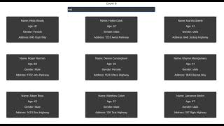

# react-search
# React Search Example

To run locally, clone this repository.
Then run npm install and npm run start.

Read the blog post at - 
[How to Search an Array of Objects in JavaScript (React)](https://learningtofly.dev/blog/how-to-search-an-array-of-objects-in-javascript-react)
# How to Search an Array of Objects in JavaScript (React)

Before we dive in, I wanted to let you know that I'm writing this post for me, for future me.  I was tasked with creating the search functionality, for a client, and they wanted to be able to search across multiple tabs and categories and have the resutls update in real time.  I spent a lot of time figuring this out where everything worked across tabs and categories but what I'm presenting here is the meat of the functionality.  If you've stumbled on to this post, I hope it saves you some time.

 

## The Search Function
The search function is just a pure JavaScript function, there's no speacial React sauce.  There are two parameters that are required, the array that you'll be searching through and the keyword that the user wants to search for.

The first step is to convert the keyword to lowercase, this is done to make matching work as we'll be doing the same for the values that we search through as well.

The next step is to use the filter function on the array.  The filter function in JavaScript returns an array of all matching elements.  The filter function will loop through each element in the array and then test to see if it is true and if so it will be added to the results.

The last step is the run the test on each value in the object and determine if there is a match.  To this we convert the string (it must be a string) to lower case and then run the match function.  The match function takes a regular expression and returns an array of all the matches, this is done by added the 'g' flag.  

One futher thing to note is there are three tests below and they are each seperated with the OR operator, therefore if any of the tests are true then the function will return true and the object will be added to the new filter array.  You may easily add additional key values to test for using this method.

 
```javascript
export const arraySearch = (array, keyword) => {
    const searchTerm = keyword.toLowerCase()
    return array.filter(value => {
        return value.name.toLowerCase().match(new RegExp(searchTerm, 'g')) ||
        value.address.toLowerCase().match(new RegExp(searchTerm, 'g')) ||
        value.gender.toLowerCase().match(new RegExp(searchTerm, 'g'))
    })
}
 ```

## Calling the Search Function

Now we'll look at how to use the arraySearch function from a React component.  Below we have a Search component that listens for an onChange event, when the onChange event is called the handleOnChange function is called (more on that in a second).  Below the Search component is the Container which iterates through the array of objects (population) by calling the map function.  The map function generates a person object which is then propagated into a Card object and displays the person's name, age, gender, and address.

 
```javascript
<div className="App">
      <div>Count: {count}
      <Search type="text" name="search" id="search" placeholder="Search Filter" onChange={handleOnChange}/>
      </div>
      
      <Container name="container">
        {population.map(person => (
        <Card key={person.guid}>
          <p>Name: {person.name}</p>
          <p>Age: {person.age}</p>
          <p>Gender: {person.gender}</p>
          <p>Address: {person.address}</p>
        </Card>
        ))}
      </Container>
    </div>
 ```

As the user types in the Search box, the handle on change the handleOnChange function is called, this function retrieves the target.value from the event.  The value is tested to see if it is greater than two in length, if so, then the population (array of objects) and the value are passed to the arraySearch function.  The result is captured as a new variable called search and that result is then passed into the population array by calling setPopulation.  setPopulation is the setter portion of a useState hook.  Also captured is the length of the array, and it's passed to the count variable by calling setCount (also a useState hook).

If the value that is passed does not have a length that is greater than two, then the orginal data set is passed to the setPopulation call and the original array length is passed to the count.

 
```javascript
const handleOnChange = async (e) => {
    let value = e.target.value;
    if (value.length > 2) {
      let search = await arraySearch(population, value);
      setPopulation(search)
      setCount(search.length)
    } else {
      setPopulation(people)
      setCount(people.length)
    }
  }
 ```

## See it in Action

Let's see it in action, one thing to notice is the Counter just above the Search input, as the user types the counter will update with the number of elements.  As you'll notice in the video, when I search for 'male' the count stays at 50.  The reason for that is the match function is searching for the existence of the string but not the whole word.  When I search for 'female' the count changes to 21.  Pay attention to the Count as I do the different searches.

 [](https://www.youtube.com/watch?v=StTqXEQ2l-Y "React Search")

 
Thanks for reading and I hope that you found this easy to understand and clear. 